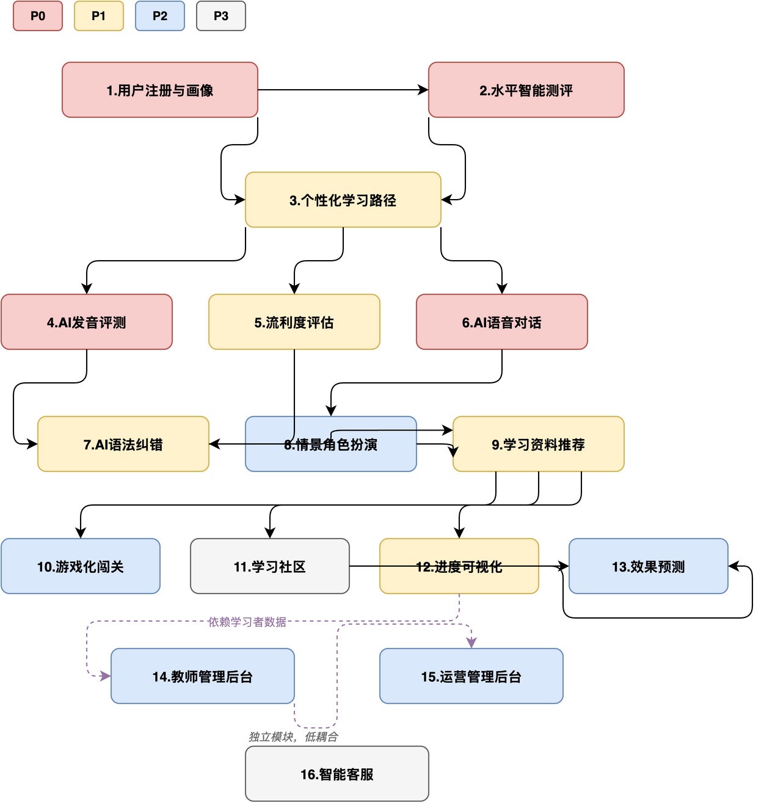

# Lingolab-ai 产品需求文档 (PRD)

> **创建时间**：2026-05-27  | **版本**：1.0 | 作者：XCY

---

## 一、整体需求分析

### 1.1 项目定位

面向全年龄段用户，以 **AI 驱动的英语口语评测 + 情景对话为核心**，提供全天候个性化口语训练服务。

### 1.2 用户角色

| 角色 | 典型场景 | 涉及模块 |
|------|---------|:---:|
| **学习者(普通用户)** | 注册→测评→跟读→对话→看进度 | 1-13 |
| **教师** | 看班级报告→布置作业→点评学生→组织比赛 | 14 |
| **运营人员** | 管用户→审内容→配活动→看数据→处理投诉 | 15 |
| **系统智能客服** | 自动答疑、问题转人工 | 16 |

### 1.3 系统边界


> 外部依赖：Deepseek API、Whisper API、TTS、对象存储
> 一期不做：直播课、线下约课、支付系统

### 1.4 模块依赖关系



### 1.5 MVP 优先级

| 优先级 | 判定标准 | 模块 |
|:---:|------|------|
| **P0** | 没有它产品不成立 | 1(画像) · 2(测评) · 4(发音) · 6(对话) |
| **P1** | 核心体验之后的闭环能力 | 3(路径) · 5(流利度) · 7(语法) · 9(推荐) · 12(进度) |
| **P2** | 增强体验，提高留存 | 8(角色扮演) · 10(游戏化) · 13(预测) · 14(教师) · 15(运营) |
| **P3** | 锦上添花，独立上线 | 11(社区) · 16(客服) |

### 1.6 技术栈

| 层次 | 选型 | 理由 |
|------|------|------|
| 前端 | Vue 3 + Vite | SPA，组件化，生态完善 |
| 后端 | Python FastAPI | AI 生态原生支持，开发效率高 |
| 数据库 | MySQL 8.0 | 成熟稳定，团队熟悉 |
| ORM | SQLAlchemy 2.0 async | 异步数据库操作 |
| 语音转写 | Whisper API | 音素级对齐能力 |
| 对话生成 | Deepseek API | LLM 对话 + 评分 |
| 语音合成 | Edge TTS（免费） | MVP 阶段降本 |

---


## 二、模块详细需求

### 模块 1：用户注册与多维度画像 `P0`

#### 需求描述

用户通过本地账号密码注册，采集年龄、学习目标、兴趣偏好，系统自动生成用户画像。注册后必须完成水平测评（模块 2）才能进入主功能。

#### 注册方式

- **本地账号密码登录**，不接入第三方登录（微信/Google/OAuth）
- 用户名 + 密码注册，用户名全局唯一
- JWT Token 鉴权，24 小时有效期

#### 注册流程

```
注册页 → 填写信息 → 提交 → 自动登录 → 强制跳转测评页（模块2）
                                              │
                                       测评完成后进入首页
```

#### 采集字段

| 字段 | 类型 | 必填 | 说明 |
|------|------|:---:|------|
| username | string | ✅ | 4-20 字符，字母数字下划线，全局唯一 |
| password | string | ✅ | 8-32 字符，含字母+数字，bcrypt 加密存储 |
| age | int | ✅ | 输入实际年龄，系统自动归类 |
| learning_goal | enum | ✅ | 日常交流 / 考试 / 商务 / 出国 / 兴趣爱好 |
| interests | multi-enum | — | 可选填：音乐/体育/科技/美食/旅行/电影/文学/其他 |

#### 年龄自动归类规则

| 年龄区间 | 归类标签 | 默认内容策略 |
|:---:|------|------|
| 6-12 | 儿童 | 趣味场景、游戏化优先、简单词汇 |
| 13-17 | 青少年 | 校园场景、考试导向可选、中等难度 |
| 18-22 | 大学生 | 学术+社交场景、四六级/雅思托福可选项 |
| 23-50 | 职场 | 商务场景、邮件电话、专业词汇 |
| 51+ | 中老年 | 旅行+日常场景、慢语速、大字界面 |

#### 水平定级逻辑

```
注册自评 level_self → 初始内容推荐（临时等级）
         │
         ▼
    必须完成模块2测评
         │
         ▼
  测评结果 level_test ←── 覆盖自评
         │
         ▼
  综合等级 = level_test（以测评为准）
```

自评仅用于测评前的初始内容难度，最终定级以测评结果为准。

#### 画像数据结构

```json
{
  "user_id": 1,
  "username": "zhangsan",
  "age_group": "大学生",
  "learning_goal": "日常交流",
  "interests": ["音乐", "旅行"],
  "level_self": "初级",
  "level_test": null,
  "level_final": null,
  "assessment_completed": false
}
```

#### 边界情况

| 场景 | 处理 |
|------|------|
| 用户名已存在 | 返回 `409`，提示「用户名已被注册」 |
| 密码不符合规则 | 返回 `422`，提示「密码需 8-32 位，包含字母和数字」 |
| 注册后未完成测评直接关闭 | 下次登录强制跳转测评页 |
| 测评中途退出 | 保存进度，重新进入时恢复上次答题位置 |
| 年龄输入异常值（<1 或 >150） | 拒绝提交，提示「请输入有效年龄」 |

#### 验收标准

- [ ] 用户名+密码可完成注册并自动登录
- [ ] 重复用户名注册返回 409 错误
- [ ] 密码 bcrypt 加密存储，数据库中不可逆
- [ ] 年龄自动归类正确（覆盖 5 个区间边界值）
- [ ] 注册后首次登录强制跳转到测评页
- [ ] 测评完成后 `assessment_completed` 变为 `true`
- [ ] 测评完成前无法访问首页/发音/对话功能


### 模块 2：英语水平智能测评 `P0`

#### 需求描述

注册后强制完成一次自适应测评，覆盖听力、口语、阅读、语法四维度，动态调整难度，精准定级 CEFR（A1-C2），定位各维度能力短板。

#### 题量与时长

- **共 10 题**，预计完成时间 8-12 分钟
- 分布：听力 3 题 + 口语 2 题 + 阅读 3 题 + 语法 2 题
- 题序交错排列（非按维度分块），减少用户疲劳

#### 自适应规则

```
初始难度 = 用户自评等级对应的 CEFR 起点

每题作答后：
  答对 → 下一题难度 +0.5 级（如 B1 → B1+）
  答错 → 下一题难度 -0.5 级

最终等级 = 10 题稳定后的难度区间
各维度能力分 = 该维度题目的正确率 × CEFR 映射
```

**CEFR 等级映射**：

| 分数区间 | CEFR 等级 | 标签 |
|------|:---:|------|
| 0-20 | A1 | 入门 |
| 21-40 | A2 | 基础 |
| 41-60 | B1 | 中级 |
| 61-80 | B2 | 中高级 |
| 81-95 | C1 | 高级 |
| 96-100 | C2 | 精通 |

#### 四维度测试方式

| 维度 | 题数 | 题型 | 评测方式 |
|------|:---:|------|------|
| 听力 | 3 | 听短对话/独白，选择正确答案 | 客观题，系统自动判分 |
| 口语 | 2 | 给定话题，用户自由表达录音 | Whisper 转写 + Deepseek 评分 |
| 阅读 | 3 | 完形填空/阅读理解 | 客观题，系统自动判分 |
| 语法 | 2 | 选择题（时态/语态/句型） | 客观题，系统自动判分 |

#### 口语题详细流程

```
1. 展示话题（如 "Describe your favorite food"）
2. 用户准备 15 秒
3. 录音 30-60 秒
4. Whisper 转写为文本
5. Deepseek 对转写文本评分：
   - 内容相关性（0-25）
   - 语法正确性（0-25）
   - 词汇丰富度（0-25）
   - 逻辑连贯性（0-25）
   → 总分 0-100
```

#### 题库管理

- **人工预录入**，保证质量可控、评分标准稳定
- 题目按 CEFR 难度标记（A1/A2/B1/B2/C1/C2）
- 每条题目包含：题目文本、选项（客观题）、正确答案、所属维度、难度等级
- MVP 阶段每难度每维度准备 ≥ 5 题（总计 ≥ 120 题）

#### 测评报告

测评完成后生成报告，包含：

```
┌─────────────────────────┐
│  测评报告               │
│  CEFR 等级：B1（中级）   │
│                         │
│  听力  ████████░░ 78    │
│  口语  ██████░░░░ 55 ← 短板 │
│  阅读  ████████░░ 82    │
│  语法  ███████░░░ 68    │
│                         │
│  建议：重点提升口语表达  │
└─────────────────────────┘
```

#### 边界情况

| 场景 | 处理 |
|------|------|
| 口语未检测到语音 | 标记 0 分，提示「未检测到语音」，不计入自适应难度调整 |
| 口语录音 < 5 秒 | 提示「录音过短，请重新作答」，允许重录 1 次 |
| 测评中断（关闭/网络） | 已答题目保存，下次继续；已答题不重复出现 |
| 10 题全部答对/全错 | 命中特殊规则：全对 → 追加 1 题 C2 难度确认；全错 → 追加 1 题 A1 难度兜底 |
| Whisper 转写失败 | 返回 500，提示用户重新录音 |

#### 验收标准

- [ ] 10 题完成时间在 8-12 分钟内
- [ ] 自适应难度调整生效（答对升、答错降）
- [ ] 口语话题自由表达可正常录音并转写
- [ ] 测评报告正确展示 CEFR 等级和四维分数
- [ ] 中途退出后可恢复进度
- [ ] 测评完成后 user_profiles.level_final 正确更新
- [ ] 测评完成前无法访问首页、发音练习、对话功能


### 模块 3：个性化学习路径规划 `P1`

#### 需求描述

基于用户画像（模块 1）和测评结果（模块 2），系统自动生成每日学习任务。用户可查看、手动调整、跳过任务。MVP 阶段用规则引擎，后续迭代引入强化学习。

#### 路径生成规则

**输入**：用户画像 + 测评四维分数 + 学习目标
**输出**：每日 3 个任务（跟读练习 + 情景对话 + 听力训练）

**规则引擎逻辑**：

```
短板优先原则：
  取四维分数最低的维度 → 作为当日任务重点

学习目标加权：
  日常交流 → 侧重日常场景对话
  商务 → 侧重商务场景 + 正式表达
  考试 → 侧重学术词汇 + 考试题型
  出国 → 侧重旅行场景 + 实用口语
  兴趣爱好 → 侧重轻松话题 + 兴趣相关内容

任务生成流程：
  1. 查找短板维度 → 确定任务类型配比
  2. 匹配 CEFR 等级 → 筛选对应难度内容
  3. 叠加学习目标 → 选择目标场景
  4. 参考年龄归类 → 调整内容风格
  5. 结合兴趣标签 → 优选相关内容
  6. 输出 3 个待推送任务
```

#### 每日任务结构

| 序号 | 任务类型 | 预估时长 | 说明 |
|:---:|------|:---:|------|
| 1 | 跟读练习 | 5-10 分钟 | 5 个句子或 10 个单词，聚焦短板音素 |
| 2 | 情景对话 | 10-15 分钟 | 1 个场景，5 轮 AI 对话 |
| 3 | 听力训练 | 5 分钟 | 1 段短对话 + 2 道理解题 |

**每日总时长**：20-30 分钟

#### 用户干预能力

| 操作 | 说明 |
|------|------|
| 跳过任务 | 可跳过当日任一任务，系统记录跳过原因（可选填） |
| 换一个 | 不满意当前任务，换同类型同难度的备选 |
| 调整难度 | 用户反馈「太简单/太难」，下次推送难度 ±1 |
| 加量 | 完成 3 个任务后可手动追加 1 个额外任务 |

#### 任务完成记录

```
daily_tasks
├── user_id, task_date
├── tasks (JSON): [{type, content_id, status(pending/skipped/completed), score, duration}]
└── completed_at
```

#### 边界情况

| 场景 | 处理 |
|------|------|
| 新用户首次使用 | 测评完成后立即生成首次任务，无需等到次日 |
| 连续 3 天跳过同一类型 | 提示「是否不想练习此类任务？」可关闭该类型 |
| 当日任务全部跳过 | 不强制，但次日推送时提示「昨天没练习哦」 |
| 用户反馈难度不适 | 立即调整后续难度，并在画像中记录难度偏好 |
| 内容池不足 | 复用历史内容但变换场景/顺序，避免重复感 |

#### 验收标准

- [ ] 测评完成后自动生成首次 3 个每日任务
- [ ] 任务内容匹配用户 CEFR 等级和学习目标
- [ ] 短板维度对应任务类型权重更高
- [ ] 用户可以跳过、换一个、调整难度
- [ ] 每日任务记录正确持久化
- [ ] 次日登录展示新任务，历史任务可回溯
